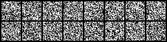
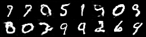
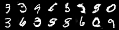
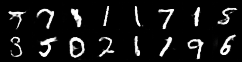
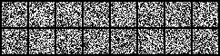
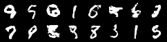
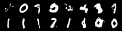
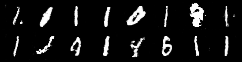

# GAN implemented with KAN convolution
We implemented a GAN with KAN convolution,the generator in the GAN uses transposed convolution and the discriminator in the GAN uses KAN convolution. 
We have implemented this GAN with KAN convolution and compared it with the GAN implemented with conventional convolution.

## Visualization
#### GAN with Conv

    
     
   
   

#### GAN with KAN convolution

      

